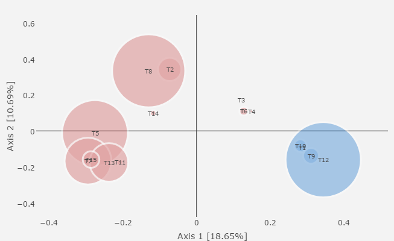
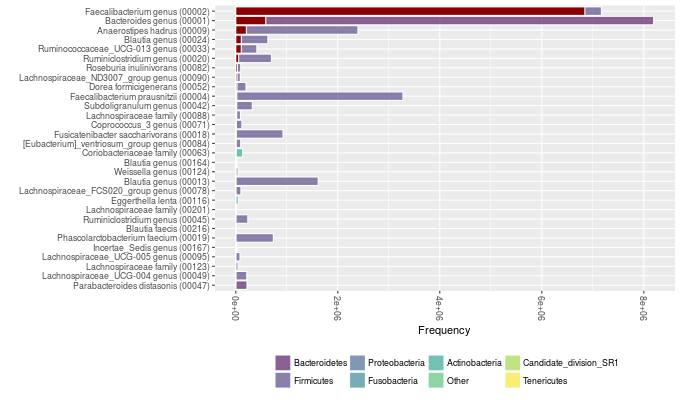
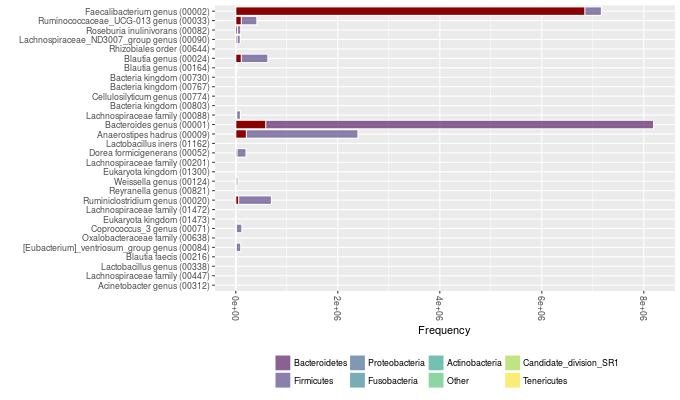
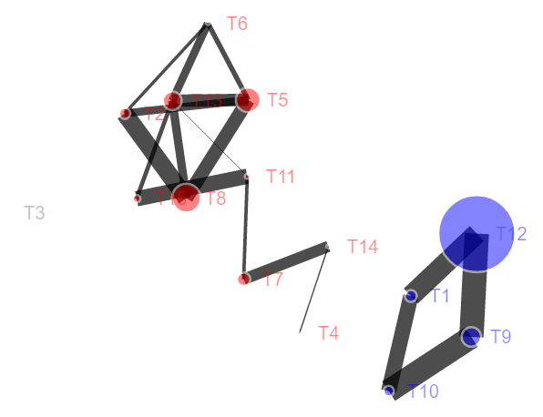
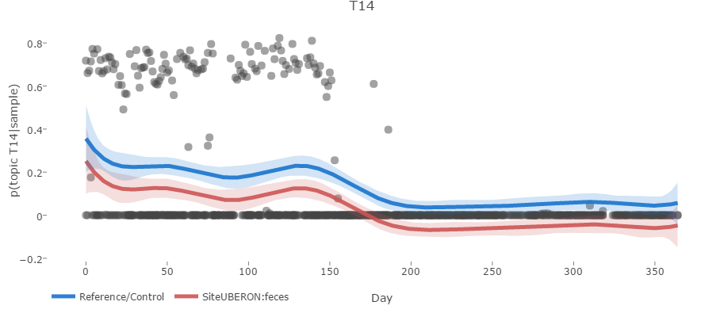
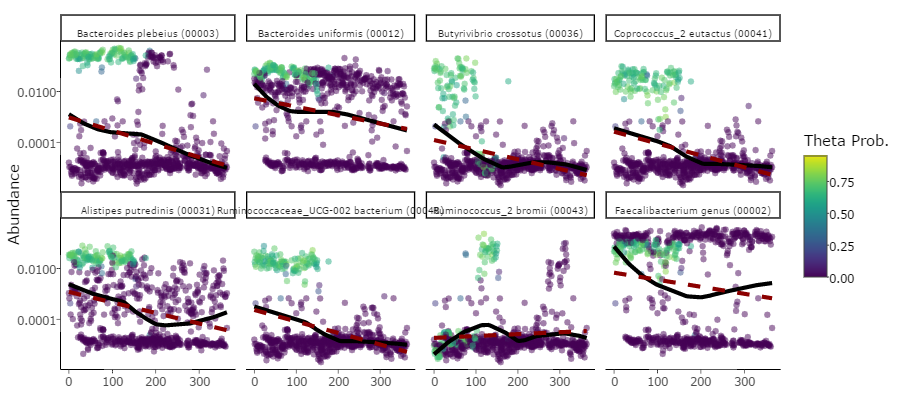
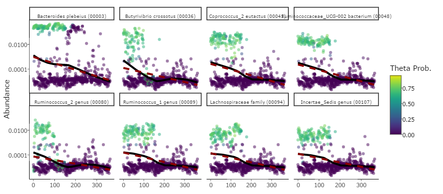
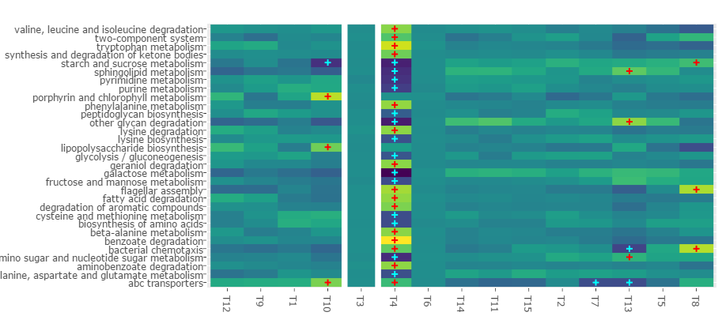
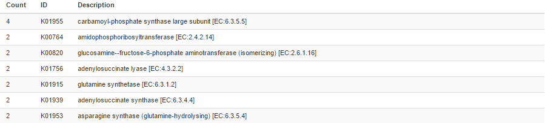

```{r,echo=FALSE}
knitr::opts_chunk$set(collapse=TRUE,comment='#>')
```

We'll start with a dataset from David et al., which contains 16S amplicon sequencing data from 2 individuals across 350 time points. It includes a sequence abundance table (similar to an OTU table, but of a Dada2 flavor), a dataframe of metadata, and a taxonomy table that were generated by a group of students for a class project, so if you are interested, the repository can be found here: https://github.com/rcargan/ECEST480_680_TimeSeriesAnalysis. Note that the David data was generated via the *Dada2* pipeline: https://github.com/benjjneb/dada2, with *Silva* as a reference database for identifying taxonomy.

## Introduction

The data is "lazyloaded," so it'll load into memory when called via simply typing **DAVID**. 

```{r,results='asis'}
library(themetagenomics)
with(DAVID,table(META$Site,META$Donor))
```

This is also the case for the Gevers et al. data, which is available by typing **GEVERS**.

## Preprocessing

We'll be utilizing topic modeling to identify useful structure in the data, so it may be obvious that we probably want to reshape our data into *documents*. We provide a function that easily preprocesses abundance data so it can be piped into our topic modeling wrappers. The function= **prepare_data** takes quite a few arguments. Two are required:

* **otu_table**: An abundance table -- either a dataframe or matrix -- of counts (non-negative integers) with appropriate row and column names for the sample IDs and the OTU or sequence IDs. The next argument determines which ID corresponds to the rows or columns of the otu_table. 

```{r}
DAVID$ABUND[1:5,1:5]
```

* **rows_are_taxa** If you are familiar with phyloseq, this should be familiar to you; otherwise, this is simply a logical flag telling the function whether the otu_table's rows or columns correspond to the taxa IDs.

Those two arguments are enough to ultimately identify topics in an unsupervised (i.e., no sample information) fashion; however, there are still some arguments you should be aware of:

* **cn_normalize**: The number of *copies* of 16S rRNA varies across bacteria, so it's recommended to adjust accordingly. This logical flag tells the function whether to adjust for copy number; it defaults to TRUE. Note that this function only adjusts for copy number if we are dealing with *OTU* abundances. If the data were fit with, say, Dada2 and hence we have *sequence* abundances, we have to adjust later in the pipeline.
* **tax_table**: If you have a taxonomy table, it should be passed as this argument. The row names of this table should correspond to the OTU or sequence IDs in the otu_table above. This can be either a dataframe or matrix.

```{r}
DAVID$TAX[1:5,1:4]
```

Now, if we have sample metadata available, and we'd like to infer relationships between sample metadata and topics, then we can pass them in as the following arguments:

* **metadata**: A dataframe containing the sample metadata. This can consist of continuous, binary, categorical, or factor covariates. The row names need to correspond to the sample IDs in the otu_table above.

```{r}
DAVID$META[1:5,1:5]
```

* **formula**: A formula object that represents the model we'd like to fit. The terms must correspond to the column names in metadata. Continuous and integer valued covariates will be treated as such, whereas categorical and factor covariates will be expanded into dummy variables. Interactions (Covariate1 * Covariate2), transformations (log10), polynomials (poly(Covariate,2)), and splines (s(Covariate)) are fair game.
* **refs**: This argument takes a string of the same length as the character and factor covariates present in the formula. It informs the function what levels in a given factor should be the reference level -- that is, the level set to zero when the factors are expanded to dummy variables. For example, if we had a factor with 3 levels -- Drug1, Drug2, and Control -- then we could set Control to the reference level and the following comparisons will be made: Drug1 against Control and Drug2 against Control. 

The ability to utilize metadata was the primary reason we chose to use the *Structural Topic Model* (STM) as our topic model package (and topic model approach for that matter) of choice -- see http://www.structuraltopicmodel.com/. The formula determines the way in which our sample metadata will influence our samples over topics distribution and hence will allow to make inferences with respect to this relationship further down the pipeline. Briefly, the formula is similar to a regression equation, with each variable getting its own weight to be estimated by the model. The dependent variable (the output) is the probability of a sample containing a given topic, modeled by a multivariate logistic normal distribution. Once everything is fit, we can explore the covariate effects by focusing on these weight estimates in the posterior distribution.

Because time is the most important variable in the David dataset, we'll use Days as a continuous covariate. Also, there are certainly differences in sample site (feces versus saliva), so we'll set that as a factor. Now, microbiomes fluctuate over time, so we can hypothesize that the relationship between time and topic frequency will be nonlinear; that is, for a given sample, the probability of containing a particular topic will possibly "wiggle" as a function of time, as opposed to strictly increase or decrease. To account for such variation, we'll use a *spline*. The STM has a user-friendly spline wrapper **s()**, which we'll use here. Regarding that binary site factor, modeling it is straightforward; we'll compare the frequency of topics given samples for one site versus the other. The direction of this comparison is what the refs argument is for in the prepare_data function. If we set refs to "UBERON:saliva," then UBERON:feces will be set to 1 in our design matrix. Positive weight estimates for this site covariate implies increases probability of containing a given topic for UBERON:feces samples. While not critical in this example, it's more important when dealing with multi-level factors, when we'd like to compare a bunch of treatments to a control group, for example. 

Let's run the prepare_date function. We'll set cn_normalize to false since we are not dealing with OTUs (the lookup table adjusts for copy number as a function of OTU ID; we'll normalize later in the pipeline since we are using Dada2 with Silva and not OTUs with GreenGenes.)

```{r}
CLEAN <- prepare_data(otu_table=DAVID$ABUND,
                      rows_are_taxa=FALSE,
                      tax_table=DAVID$TAX,
                      metadata=DAVID$META,
                      formula=~Site + s(Day),
                      refs='UBERON:saliva',
                      cn_normalize=FALSE,
                      drop=TRUE)
```

The output is a themetadata class object, containing our preprocessed data. This function performs the following: 

* All NA values in the relavent metadata are dropped
* Column names and row names are ensured to both exist and be consistent across objects
* Factors are expanded into dummy variables
* Empty rows and columns are dropped
* Generates an initial seed (if one isn't provided) that will set the stage for all subsequent seeds in the pipeline

This object can be directly passed into our STM wrapper, **find_topics**. The only thing we have to do is specify the number of topics, which we'll keep small for the sake of time.

## Topics

```{r}
system.time(TOPICS <- find_topics(CLEAN,K=15))
```

We now have an object of class *topics*. We can print some information by just typing its name:

```{r}
TOPICS
```

We can also visualize it by running **vis(TOPICS)**, but let's hold off for now. We can obtain the same visualization, but with additional information, if we now measure the effects of our covariates found in the formula we passed into prepare_data. We have a simple method to do so

```{r}
system.time(TOPIC_EFFECTS <- est(TOPICS))
```

Like our topics object, this *effects* object also prints out useful information when called:

```{r}
TOPIC_EFFECTS
```

This object contains all of our covariate information, ranging from estimates and uncertainty intervals to posterior predictions, depending on the type of covariate provided in the formula. Let's go through some of these estimates to give you an idea of what is being estimated. We initially passed in Site and Day. Site is a binary factor, and we set its reference as "UBERON:feces." Its effect estimate will result from exploring the posterior predictive distribution. For a given topic, we calculate the predicted topic probability given the weights estimated in our model, averaging across samples, but with $X_{feces}=1$. We do the same for $X_{feces}=0$, and then we calculate the difference between both predictions. This essentially measures the effect of site by comparing when the effect is "on" versus when it's "off." We average these prediction estimates across a bunch of posterior samples (which can be controls via the npoints argument in est), allowing us to obtain a mean, as well as "uncertainty intervals.":

```{r}
TOPIC_EFFECTS$topic_effects$`SiteUBERON:feces`$est
```

The continuous covariate Day is treated somewhat differently, particularly because we used a spline. Our intention for these estimates was to guide the user during the visualizations. Say you had 100 topics, which one should you investigate first? We'll, that was the idea. For splines, because there are potentially so many weights and because they're nonlinear, it's difficult to simply obtain a single predicted value or slope that's meaningful. Instead, we calculate the predicted 
topic probabilities given samples from the posterior predictive distribution, spanning over the continuous covariates range. We then calculate the standard
deviation of these predictions, giving us an idea of the variation in the nonlinear fit. This informs us which topics to explore first. Here are the results:

```{r}
TOPIC_EFFECTS$topic_effects$Day$est
```

We have quite a few visualizations at our disposal. Using the method **vis** and declaring the type of visualization we prefer, we can deploy an interactive shiny application. We'll start by simply looking at the taxa:

```{r,eval=FALSE}
vis(TOPIC_EFFECTS,type='taxa')
```

If we start at the top, there's a set of blue, gray, and red points with (quite small) uncertainty intervals. These are simply the estimates and intervals we printed out above.


To its left, you should see that the covariate these points correspond to is UBERON:feces. Just to remind you, we set saliva as our reference level, hence the covariate name, and these points represent the weight estimates with topic probability as the dependent variable. Red and blue points indicate respective positive and negative values whose uncertainty intervals don't enclose 0; hence, fecal samples are somewhat associated with the majority of topics, whereas salival samples are strongly associated with topic 12. If we shift our focus to the middle figures, this topic-covariate relationship should be clearer:



Note that this row of figures borrows *heavily* from LDAvis: https://github.com/cpsievert/LDAvis. The left figure ordinates the topics over samples distribution, showing the top 2 axes in terms of variation explained. The distance (or method) can be chosen, but defaults to Jensen Shannon. Here, we can see that the topic that had a negative estimate (blue), and hence was associated with salival samples, is quite dissimilar to the others. The figure to the right shows the overall frequency of the taxa in our dataset. If we click a topic of interest in the ordination figure, say topic 5, then the bar plot will adjust and show the relative frequency of topic 5 taxa (red bars) relative to these taxa sample-wide distribution:



If we adjust the the lambda slider, we can manipulate this figure further. The slider controls the relevancy, which in turn dictates the set of taxa shown. Relevancy is defined as follows: $$r := \lambda \log p(taxa|topic) + (1-\lambda) \log p(taxa|topic)/p(word)$$

So, at the default value of 1, we see the words with maximum probability in the words over topics distribution that estimated directly by the topic model. The figure will therefore show us the words most probable in the selected topic. If we move to the slider to say, 0.2 (see below), the we are weighting this probably by the overall probability of a given word. We'll now see words that are not only highly probably within a given topic, but also highly probably in that topic *relative* to other topics. For more information, see https://nlp.stanford.edu/events/illvi2014/papers/sievert-illvi2014.pdf.



The bottom row has an interactive notework figure that shows topic correlations, which were estimated directly by the topic model through the multivariate logistic normal distribution. This figure indicates which topics co-occur across samples, with the size of the edges reflecting the degree of the positive correlation. The node colors and sizes are set to be consistent with the ordination plot:



We should now have a decent grasp of which topics are important with respect to site, which topics co-occur, which taxa co-occur, and which taxa associate with which topics. That's a lot of information, but hopefully this shiny app makes it manageable. At this point, though, you might be asking about that Day covariate. This is a time series dataset after all. Well, themetagenomics has a better visualization for continuous covariates, so we'll use that:

```{r,eval=FALSE}
vis(TOPIC_EFFECTS,type='continuous')
```

This app should look familiar. Again, we'll start from the top. As mentioned before, these estimates have a different interpretation. Had we assumed a linear association between topic frequency and time, looking at the weights themselves (i.e., the slopes) would suffice, but we used a spline. We therefore show the Spearman correlation estimates between the posterior predictive distribution and the raw samples over topics distribution. This at least gives us an idea of where the nonlinear estimates map the best. Let's select topic 14:



There's a clear trend: the probability of a sample containing topic 14 is highest during the first half year and then becomes effectively 0. Now, we can take this a step further. When we performed our effects estimation, for a given continuous covariate, all factors are compared to their respective reference level (hence the need of expanding factors to dummy variables). Thus, the red line is the trend over time with all covariate weights held fixed (that is, averaged across all samples) and the weight for site set to 1, whereas the blue line (the reference) is when site is set to 0. Although the uncertainty is larger early, between days 40 and 175, there seems to be a discernible difference between the frequency of topic 14 across these samples. What does that mean taxonomically though? I mean, this is microbiome data! Well, if we scroll down, we can see a bunch of scatter plots. These are the true abundances (i.e., the abundances from the raw data) from highest probability taxa in topic 14, plotted as a function of Day. Each point represents a sample. 



We now have some understanding of which taxa are associated with the trend we're seeing in topic 14, specifically *B. plebeius*, *B. uniformis*, and *B. crossotus*. They each have high probability in the first half of the series, which abruptly plummets. We again have the ability to adjust lambda to adjust the relevancy. Let's set it to 0.1.



## Functions

We'll shift gears now. We're going to explore the predicted functional content in our topics. Because this data was fit with Dada2 using Silva, we have to use *Tax4Fun* and not *PICRUSt*. We can predict *KEGG* annotations by simply using the **predict** method on our topics object from before. Recall how we *didn't* copy number normalize? Now we will.

```{r}
system.time({
tmp <- tempdir()
download_ref(tmp,reference='silva_ko',overwrite=FALSE)
FUNCTIONS <- predict(TOPICS,reference='silva_ko',reference_path=tmp,cn_normalize=TRUE,sample_normalize=FALSE,scalar=25)
})
```

This functions object contains all of the predicted *KO terms* for Silva annotated abundances. There are a few settings you can adjust when running Tax4Fun, so definitely experiment, but the argument worth noting is scalar. Typically, we pass counts into PICRUSt or Tax4Fun; however, since we are using topic frequencies, we need to scale our topic over taxa distribution into pseudocounts. The scalar argument dictates what we are going to scale the maximum abundances to. It defaults to 100, but for the sake of time (since these models can take a while to fit), we set it to 25. 

Now that we have these predicted functions, we need to identify meaningful genes as a function of topic. We'll do that via a *multilevel model*. We could try our luck using *maximum likelihood* (ML), but given the sparsity of this type of data, rarely do these models converge. Instead, we'll initialize our target parameters using ML and then fit our model via *Hameltonian Monte Carlo* (HMC) using *Stan*. Like the other commands we've seen thus far, we use a method called **est** on our functions class. There are a few arguments we can adjust. First, we can choose the level of the KEGG hierarchy to use as our factor-levels in our pathway factor (my apologies for the multiple use of "level"). We'll choose level 3 since level 2 is often too broad to capture any effects. Second, we can choose the priors. These default to t-distributions. We'll go with something a little more tighter and hence informative to hopefully speed of convergence: 3 normal priors. We could also choose a Laplace prior, which effectively is the Bayesian lasso. Considering the high dimensionality of these pathway groupings, it is certainly worth trying. 

It should be noted that we are choosing the number of chains (so the number of runs to perform from independent starting conditions) and also the number of cores (to run these chains in parallel). For this vignette, it'll be set to 2, since most machines should be able to parallelize across 2 cores. It is recommended to use more cores if they are available, however.


```{r,eval=FALSE}
FUNCTION_EFFECTS <- est(FUNCTIONS,level=3,iters=300,
                        chains=2,cores=2,
                        return_summary=TRUE,
                        prior=c('normal','normal','normal'))
```

Overall, running the that function takes about 20 minutes: 15 for the actual multilevel model, about 5 for calculate the initial values via ML, and another 5 to extract results. Nevertheless, prioritizing speed left us with a model that failed to converge: 16 parameters had Rhat values greater than 1.1. We'll refit the model with more iterations, but pass in our current fit to speed through the time usually devoted to compiling. We'll initialize at our last sample from our current fit. We'll use the method **resume** and double our original number of iterations:

```{r,eval=FALSE}
FUNCTION_EFFECTS2 <- resume(FUNCTION_EFFECTS,init_type='last',iters=600,chains=2,cores=2)
```

Finally, we can visualize our output in the same way we did before. For function visualizations, however, we need to pass in *both* the function effects object and the topic effects we fit before.

```{r,eval=FALSE}
vis(FUNCTION_EFFECTS2,TOPIC_EFFECTS,ui_level=.95)
```

Again, we are guided by the scatter plot at the top. The second row contains a heatmap showing the topics over taxa distribution, which we were indirectly introduced to in previous plots. We can hover over clusters to identify the key bacteria. This heatmap simply allows us to tie the significant functions to specific clusters of co-occurring taxa. Also note we can adjust the distance metric used for clustering. Now, if we move down to the third row, we'll see the function-topic heatmap:



This heatmap shows essentially the function-topic interactions from the hierarchical model we just fit. Since we have weights that vary as a function of topic and other weights that vary as a function of pathway, these weights show shifts in gene abundance specific to certain function-topic combinations. Yellow and blue imply high and low abundances of genes within a given function-topic combination, respectively. The crosses indicate whether the interaction weight enclosed 0 given the user defined uncertainty interval (95% in this case). If we click this cell, a table will generate below:



These are the genes found within this particular function-topic combination, ordered in terms of decreasing abundance. With this information, we can identify gene sets of interest in topics we have previously identified as important with respect to our target covariates. Note, however, that these interactions aren't very meaningful since we chose such a small scalar; the predicted gene abundances are quite small.
