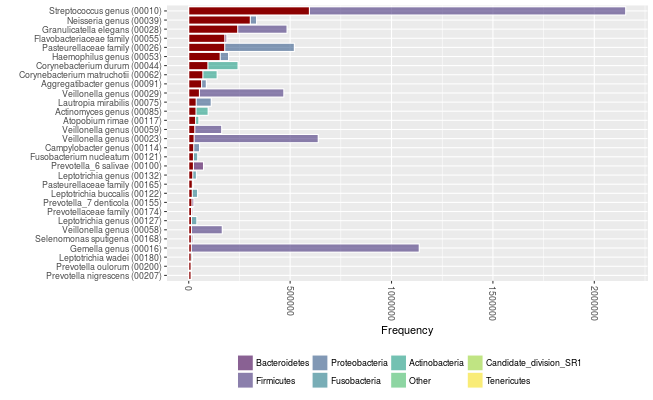
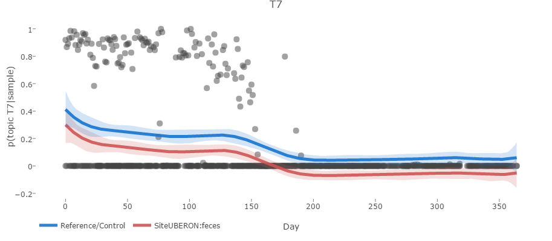
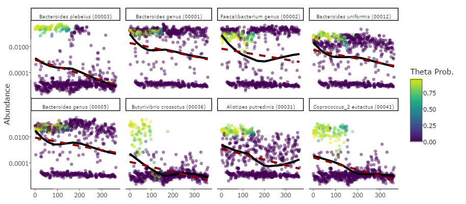
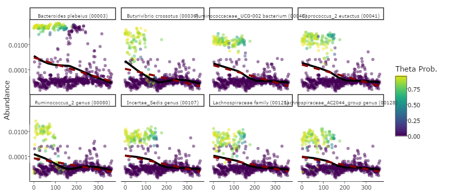

```{r,echo=FALSE}
knitr::opts_chunk$set(collapse=TRUE,comment='#>')
set.seed(1014)
```

We'll start with a dataset from David et al., which contains 16S amplicon sequencing data from 2 inviduals over 350 time points.  The data contains a sequence abundance table (similar to an OTU table, but of a Dada2 flavor), a dataframe of metadata, and a taxonomy table, that were generated by a group of students for a class project, so if you are interested, the repository can be found here: https://github.com/rcargan/ECEST480_680_TimeSeriesAnalysis.  Note that the David data was generated via the *Dada2* pipeline: https://github.com/benjjneb/dada2, with Silva as a reference database for identifying taxonomy:

## Introduction

```{r,results='asis'}
library(themetagenomics)
with(DAVID,table(META$Site,META$Donor))
```

Note that the data is "lazyloaded," so it'll load into memory when called via simply typing **DAVID**. This is also the case for the Gevers et al. data, which you can explore in the functional_prediction vignette. 


## Preprocessing

You're provided with a sequence abundance table (similar to an OTU table, but of a Dada2 flavor), a dataframe of metadata, and a taxonomy table, all of which are accessable in the list DAVID. We'll be utilizing topic modeling to identify useful structure in our data, so it may be obvious that we probably want to reshape our data into "documents." We provide a function that easily preprocesses this type of data so it can be easily piped into our topic modeling wrappers. The function **prepare_data** takes quite a few arguments. **Important: LIST Inputs here on each line and give a description**. In addition to the abundance, taxonomy, and metadata tables, it also accepts a formula, a vector of reference levels, and a few logical flags for normalizing the abundance table by copy number (relevant for OTUs) and dropping empty rows or columns. The formula is important and is the primary reason why we chose to use the *Structural Topic Model* (STM) as our topic model package (and topic model for that matter) of choice -- see http://www.structuraltopicmodel.com/. The formula determines the way in which our sample metadata will influence our samples over topics distribution and hence will allow to make inferences with respect to this relationship further down the pipeline. Briefly, the formula reflects a regression equation, with each variable getting its own weight to be estimated by the model. The dependent variable (the output) is the probability of a given topic, modeled via a multivariate logistic normal distribution. Once everything is fit, we can explore the covariate effects by focusing on these weight estimates in the posterior.

Because time is the most important variable in this dataset, we'll use Days as a continuous covariate. Also, there are certainly differences in sample site (feces versus saliva), so we'll set that as a binary factor. Now, microbiomes *fluctuate* over time, so we can hypothesize that the relationship between time and topic frequency will be nonlinear; that is, for a given sample, the probability of containing a particular topic will possibly "wiggle" as a function of time, as opposed to strictly increase or decrease. To account for such variation, we'll use a spline. The STM has a user-friendly spline wrapper s(), which we'll use here. Regarding that binary site factor, modeling it is straightforward; we'll compare the frequency of topics given samples for one group versus the other. The direction of this comparison is what the refs argument is for in the **prepare_data** function. If we set refs to "UBERON:saliva," then UBERON:feces will be set to 1 in our design matrix and positive weight estimates for this site covariate implies increases probability of containing a given topic for UBERON:feces samples. While not very significant in this example, it's likely more obvious when dealing with multi-level factors, when we'd like to compare a bunch of treatments to a control group. Let's run the prepare_date function. We'll set cn_normalize to false since we are not dealing with OTUs (the lookup table adjusts for copy number as a function of OTU ID; we'll normalize later in the pipeline since we are using Dada2 with Silva and not OTUs with GreenGenes.)

```{r}
CLEAN <- prepare_data(otu_table=DAVID$ABUND,
                      rows_are_taxa=FALSE,
                      tax_table=DAVID$TAX,
                      metadata=DAVID$META,
                      formula=~Site + s(Day),
                      refs='UBERON:saliva',
                      cn_normalize=FALSE,
                      drop=TRUE)
```

The output is a themetadata class object, containing our preprocessed data. All NA values in the relavent metadata have been dropped. Column names and row names were ensured to both exist and be consistent across objects. Also, factors were expanded into dummy variables and empty rows and columns were dropped. This object can be directly passed into our STM wrapper, **find_topics**. The only thing we have to do is specify the number of topics, which we'll keep small for the sake of time.

## Topics

```{r}
system.time(TOPICS <- find_topics(CLEAN,K=15))
```

We now have an object of class "topics." We can print some information by just typing its names:

```{r}
TOPICS
```

We can also visualize it by running vis(topics), but let's hold off for now. We can obtain the same visualization, but with additional information, if we now measure the covariate effects by sampling from our posterior distribution of our fit. We have a simple method to do so

```{r}
system.time(TOPIC_EFFECTS <- est(TOPICS))
```

Like our topics object, this effects object also prints out useful information when called:

```{r}
TOPIC_EFFECTS
```

This object contains all of our covariate information, ranging from estimates and uncertainty intervals to posterior predictions. We have quite a few visualizations at our disposal. Using the method vis and declaring the type of visualization we prefer, we can deploy an interactive shiny application. We'll start by simply looking at the taxa:

```{r,eval=FALSE}
vis(TOPIC_EFFECTS,type='taxa')
```

** what?! why don't you explain here what Estimate means?  I also do not get the same plot that you get below.** If we start at the top, there's a set of blue, gray, and red points with (quite small) uncertainty intervals. 


To the left, you should see that the covariate these points correspond to is UBERON:feces. If you recall, we set saliva as our reference level, hence the covariate name. These points represent the weight estimates with topic frequency as the dependent variable. Red and blue points indicate respective positive nad negative points whose uncertainty intervals don't enclose 0; hence, fecal samples are strongly associated with topic 8. If we shift our focus to the middle figures, this topic-covariate relationship should be clearer:


Note that this row of figures borrows *heavily* from LDAvis: https://github.com/cpsievert/LDAvis. This left figure ordinates the topics over samples distribution, showing the top 2 axes in terms of variation explained. The distance (or method) can be chosen, but defaults to Jensen Shannon. Here, we can see that the topics that had negative weights (blue), and hence were associated with saliva samples, are similar to one another, and are well-separated from most topics associated with fecal samples (red). The figure to the right shows the overall frequency of the taxa in our dataset. If we click a topic of interest in the ordination figure, say topic 9, then the bar plot will adjust and show the relative frequency of topic 9 taxa (red bars) relative to these taxa sample-wide distribution:



The bottom row has an interactive notework figure that shows topic correlations. This figure indicates which topics co-occur across samples, with the size of the edges reflecting the degree of the possitive correlation. The node colors and sizes are set to be consistent with the ordination plot:


We should now have a decent grasp of which topics are important with respect to site, which topics co-occur, which taxa co-occur, and which taxa associate with which topics. That's a lot of information, but hopefully that shiny application makes it manageable. At this point, though, you might be asking about that Day covariate. This is a time series dataset afterall. Well, themetagenomics has a better visualization for continuous covariates, so we'll use that:

```{r,eval=FALSE}
vis(TOPIC_EFFECTS,type='continuous')
```

This app should look familiar. Again, we'll start from the top. For continuous effects, these "weights" have a different interpretation. Our goal for the top row figures in the last two apps is to guide the user, helping he or she to target topics of interest. It might not be very clear now, but imagine dealing with 60 topics. Knowing which to explore furthur is pretty important. Hence, for continuous covariates, we wanted to help identify which points to click. Had we assumed a linear association between topic frequency and time, looking at the weights themselves (i.e., the slopes) would suffice, but recall we used a spline. We therefore show the Spearman correlation estimates between the posterior predictive distribution and the raw samples over topics distribution. This at least gives us an idea of where the nonlinear estimates map the best. Let's select topic 7:



There's a clear trend: the probability of a sample containing topic 7 is highest during the first half year and then becomes effectively 0. Now, we can take this a step further. When we performed our effects estimation, for a given continuous covariate, all factors are compared to their respective reference level (hence the need of expanding factors to dummy variables). Thus, the red line if the trend over time with all covariate weights held fixed (that is, averaged across all samples) and the weight for site set to 1, whereas the blue line (the reference) is when site is set to 0. Although the uncertainty is larger early, between days 40 and 175, there seems to be a discernible difference between the frequency of topic 7 across these samples. What does that mean taxanomically though? I mean, this is microbiome data! Well, if we scroll down, we can see a bunch of scatter plots. These are the true abundances (i.e., the abundances from the raw data) from highest probability taxa in topic 7, plotted as a function of time. Each point represents a sample. 



We now have some understanding of which taxa are associated with the trend we're seeing in topic 7, specifically B. plebeius, B. crossotus, and C. eutactus. They each have high probability in the first half of the series, which abruptly plummets. One further adjustment you can make is by scrolling through different values of lambda, which controls the taxa relevance. It defaults to 1, which implies that you are effectively seeing the $\beta$ posterior -- that is, the probability of a taxa given a topic. By lower lambda, you begin to scale this value by the probability of the taxa across the entire dataset. This may shed some light on taxa that are not only highly probable within a given topic, but also more probable *relative* to other topics. This is again topic 7, but with lambda set to 0.1:



## Functions

We'll slightly shift gears now. We're going to explore the predicted functional content in our topics. Because this data was fit with Dada2 using Silva, we have to use **Tax4Fun** and not PICRUSt. We can predict KEGG annotations by simply using the predict method on our topics object from before. Recall how we *didn't* copy number normalize? Now we will.

```{r}
system.time({
tmp <- tempdir()
download_ref(tmp,reference='silva_ko',overwrite=FALSE)
FUNCTIONS <- predict(TOPICS,reference='silva_ko',reference_path=tmp,cn_normalize=TRUE,sample_normalize=FALSE,scalar=25)
})
```

This functions object contains all of the predicted KO terms for Silva annotated abundances. There are a few settings you can adjust when running Tax4Fun, so definitely experiment, but the argument worth noting is scalar. Typically, we pass counts into PICRUSt or Tax4Fun; however, since we are using topic frequencies, we need to scale our topic over taxa distribution into pseudocounts. The scalar argument dictates what we are going to scale the maximum abundances to. It defaults to 100, but for the sake of time (since these models can take a while to fit), we set it to 25. 

Now that we have these predicted functions, we need to identify meaningful genes as a function of topic. We'll do that via a hierarchical model. We could try our luck using *maximum likelihood* (ML), but given the sparisity of this type of data, rarely do these models converge. Instead, we'll initialize our target parameters using ML and then fit our model via *Hameltonian Monte Carlo* (HMC) using *Stan*. Like the other commands we've seen thusfar, we use a method called **est** on our functions class. There are a few arguments we can adjust. First, we can choose the level of the KEGG hierarchy to use as our levels in our pathway factor. We'll choose level 3 since level 2 is often too broad to pick up any effects. Second, we can choose the prior. These default to t-distributions. We'll go with something a little more informative to speed of convergence: 3 normal priors. We could also choose a Laplace prior, which effectively is the Bayesian lasso. Considering how high dimensional these pathway groupings can be, it is probably worth exploring. 

It should be noted that we are choosing the number of chains (so the number of runs to perform from independent starting conditions) and also the number of cores (to run these chains in parallel). For this vignette, it'll be set to 2, since most machines should be able to parallelize across 2 cores. It is recommended to use more cores if they are available, however.


```{r,eval=FALSE}
FUNCTION_EFFECTS <- est(FUNCTIONS,level=3,iters=300,
                        chains=2,cores=2,
                        return_summary=TRUE,
                        prior=c('normal','normal','normal'))
```

Prioritizing speed left us with a model that was plauged with convergence issues (this could also be due to the degree of filtering we did using a scalar of 25). We'll refit the model with more iterations, but pass in our current fit to speed past the time usually devoted to compiling. We'll now initialize at our last sample from our current fit. We'll use the method **resume** and double our original number of iterations:

```{r,eval=FALSE}
FUNCTION_EFFECTS2 <- resume(FUNCTION_EFFECTS,init_type='last',iters=600,chains=2,cores=2)
```

Finally, we can visualize our output in the same way we did before. For function visualizations, however, we need to pass in *both* the function effects object and the topic effects we fit before.

```{r,eval=FALSE}
vis(FUNCTION_EFFECTS2,TOPIC_EFFECTS,ui_level=.95)
```

Again, we are guided by the scatter plot at the top. The second row contains a heatmap showing the topics over taxa distribution, which we were indirectly introduced to in previous plots. We can hover over clusters to identify the key bacteria. This heatmap simply allows us to tie the significant functions to specific clusters of co-occuring taxa. Also note we can adjust the distance metric used for clustering. Now, if we move down to the third row, we'll see the function-topic heatmap:


This heatmap shows essentially the function-topic interactions from the hierarchical model we just fit. Since we have weights that vary as a function of topic and other weights that vary as a function of pathway, these weights show shifts in gene abundance specific to certain function-topic combinations. Yellow and blue imply high and low abundances of genes within a given function-topic combination, respectively. The crosses indicate whether the interaction weight enclosed 0 given the user defined uncertainty interval (95% in this case). Let's focus on topic 8. One noteable interaction involves bacterial chemtaxis. If we click this cell, a table will generate below:


These are the genes found within this particular function-topic combination, ordered in terms of decreasing abundance. With this information, we can identify gene sets of interest in topics we have previously identified as important with respect to our target covariates. 
